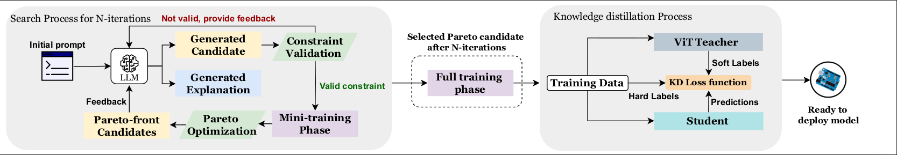
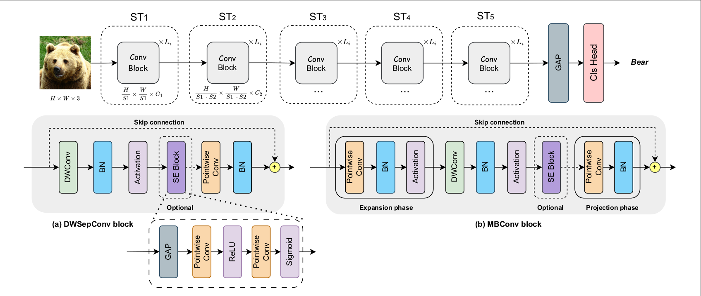
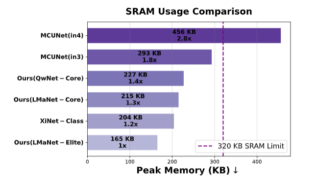

# Can LLMs Revolutionize the Design of Explainable and Efficient TinyML Models? 
## 🏆 Best Student Paper Award – IJCNN 2025 (Rome, Italy)



<p align="center"><strong><span style="font-size:18px">(1) End-to-End Optimization Framework</span></strong></p>



<p align="center"><strong><span style="font-size:18px">(2) Search space</span></strong></p>


## Overview
This repository provides the official implementation of a novel framework for designing efficient neural network architectures tailored to **TinyML** platforms.

We propose a unified pipeline that combines:

- 🔍 **LLM-guided Neural Architecture Search (NAS)**
- 📈 **Pareto-based optimization** (accuracy, MACs, memory)
- 🧠 **Logits-based Knowledge Distillation (KD)** using ViT-B/16
- 💬 **Explainability module** for interpretable model design

The goal is to achieve **high accuracy**, **low memory usage**, and **efficient computation**, specifically under **320 KB SRAM** and **<100M MACs**, suitable for deployment on resource-constrained MCUs such as the **STM32H7**.

## Results
Our framework produced three optimized models:

| Model         | Accuracy (CIFAR-100) | MACs (M) | SRAM (KB) |
|---------------|-----------------------|----------|-----------|
| LMaNet-Elite  | 74.50%                | <100     | <320      |
| LMaNet-Core   | 74.20%                | <100     | <320      |
| QwNet-Core    | 73.00%                | <100     | <320      |

These outperform current state-of-the-art TinyML models on CIFAR-100:

- MCUNet-in3: **69.62%**
- MCUNet-in4: **72.86%**
- XiNet: **72.27%**



## 🛠️ TO-DO
- [ ] Refactor code for modularity and documentation
- [ ] Include automation scripts
- [ ] Upload quantized weights and QAT training script with OpenVino
- [ ] Include object detection model support
- [ ] Add inference scripts for STM32H7 (TFLM)

## 📄 Read the Paper

[🔗 Click here to read the paper (PDF)](https://github.com/christophezei/llm-nas-kd-explainability/blob/main/main.pdf)

## 📄 Citation
If you use this repository in your research or product, please cite:

```bibtex
@misc{zeinaty2025llmsrevolutionizedesignexplainable,
      title={Can LLMs Revolutionize the Design of Explainable and Efficient TinyML Models?}, 
      author={Christophe El Zeinaty and Wassim Hamidouche and Glenn Herrou and Daniel Menard and Merouane Debbah},
      year={2025},
      eprint={2504.09685},
      archivePrefix={arXiv},
      primaryClass={cs.LG},
      url={https://arxiv.org/abs/2504.09685}, 
}
```

---

For questions, feel free to open an issue or reach out via email. Contributions welcome!
